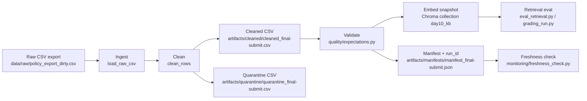

# Kiến trúc pipeline — Lab Day 10

**Nhóm:** AI in Action Day 10 lab team  
**Cập nhật:** 2026-06-10  
**Run chuẩn:** `final-submit`

---

## 1. Sơ đồ luồng

Run `final-submit` ghi log tại `artifacts/logs/run_final-submit.log`, manifest tại `artifacts/manifests/manifest_final-submit.json`, và dùng `run_id` trong metadata vector Chroma.

---

## 2. Ranh giới trách nhiệm

| Thành phần | Input | Output | Owner nhóm |
|------------|-------|--------|--------------|
| Ingest | `data/raw/policy_export_dirty.csv` | List raw rows, `raw_records=247` | Ingestion / Raw Owner |
| Transform | Raw rows + contract allowlist | Cleaned rows `27`, quarantine rows `220` | Cleaning & Quality Owner |
| Quality | Cleaned rows | Expectation pass/fail; halt nếu fail severity `halt` | Cleaning & Quality Owner |
| Embed | Cleaned CSV | Chroma collection `day10_kb`, `embed_upsert count=27` | Embed & Idempotency Owner |
| Monitor | Manifest JSON | `freshness_check=FAIL` với lý do SLA exceeded trên snapshot mẫu | Monitoring / Docs Owner |

---

## 3. Idempotency & rerun

Pipeline publish index theo snapshot cleaned. `chunk_id` được sinh ổn định từ `doc_id`, cleaned text và sequence, sau đó Chroma dùng `upsert(ids=chunk_id)`. Trước upsert, pipeline gọi `col.get()` và xóa các vector id không còn trong cleaned run mới, vì vậy rerun không làm phình collection và không giữ chunk stale trong top-k retrieval.

Expectation `unique_non_empty_chunk_id` bảo vệ contract này. Trong run `part2-cleaning-final`, log có `embed_prune_removed=12`, chứng minh index cũ được prune khi cleaned snapshot thay đổi.

---

## 4. Liên hệ Day 09

Pipeline này cung cấp corpus sạch cho retrieval/agent giống case Day 08-09, nhưng tách collection thành `day10_kb` để không ảnh hưởng artifact Day 09. Các nguồn canonical vẫn là cùng domain CS + IT Helpdesk: refund, SLA P1, IT FAQ, HR leave, và access control SOP.

---

## 5. Rủi ro đã biết

- `freshness_check=FAIL` trong run `final-submit` vì CSV mẫu có `latest_exported_at=2026-04-11T00:00:00`, cũ hơn SLA 24 giờ khi chạy ngày 2026-06-10.
- Min effective date hiện cấu hình trong code/contract; bản production nên đọc cutoff từ contract/env để tránh hard-code.
- Eval dùng keyword + embedding retrieval, chưa có LLM-judge.
- Warning Chroma telemetry và urllib3 LibreSSL xuất hiện trên máy local nhưng không chặn pipeline.
